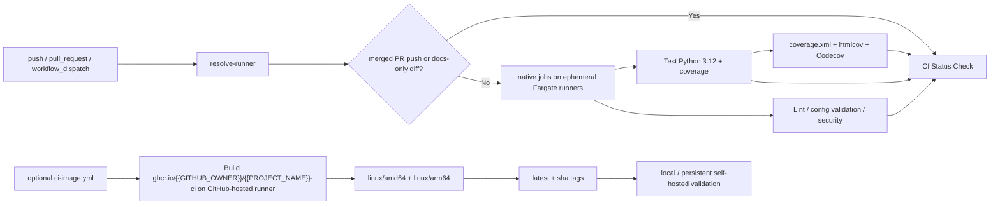

# CI/CD Pipeline Documentation

This document describes the Continuous Integration pipeline for {{PROJECT_NAME}}, including ephemeral Fargate runners, runner resolution, the companion secret-scanning workflow, and local validation.

## Overview

The CI workflow runs on pushes and pull requests targeting `{{MAIN_BRANCH}}` and `{{DEV_BRANCH}}`. New projects default to ephemeral ECS Fargate runners and install their Python toolchain directly in each job. GitHub-hosted and persistent self-hosted runners remain manual fallbacks.

## CI Jobs (`.github/workflows/ci.yml`)

### Runner Resolution

- `resolve-runner` decides which runner labels downstream jobs should use.
- The default target comes from `{{CI_RUNNER}}`.
- Manual `workflow_dispatch` runs can override the target with:
  - `fargate`
  - `github_hosted`
  - `self_hosted_linux`
  - `self_hosted_linux_arm64`
- Downstream jobs use `runs-on: ${{ fromJSON(needs.resolve-runner.outputs.runner) }}`.
- `fargate` resolves to `[self-hosted, fargate]`; one ephemeral runner task claims one queued job and exits.

### Smart Skip Logic

`resolve-runner` classifies whether the expensive jobs should be skipped before checking out the repository:

- docs-only changes matching `docs/**`, `notes/**`, `README.md`, `AGENTS.md`, or `CLAUDE.md`
- push-to-`{{MAIN_BRANCH}}` commits that GitHub already associates with a merged pull request
- merge-commit fallback heuristic when the API association is temporarily unavailable

The aggregate `CI Status Check` job still runs and reports the skip reason, so the skip path is explicit rather than a silent green pass.

### Fargate-Native Execution Model

Main CI jobs execute directly on the resolved runner:

- checkout path isolation via `path: repo`
- `safe.directory` configured in every job
- `actions/setup-python` selects the requested Python version
- dependencies and pinned security tools are installed per job

Fargate runners do not provide nested Docker job containers, so the main workflow must not use a top-level `container:` block. The shared CI image under `infra/ci/` remains available for local checks and non-Fargate runners; its image-publish workflow stays GitHub-hosted because the Fargate runner cannot run Docker-in-Docker builds.

### Failure Short-Circuiting

- workflow concurrency cancels stale pull-request runs on new pushes
- the Python 3.12 test job enforces coverage in the same run
- each check job requests workflow cancellation via the Actions API if it fails

## Job Summary

### 1. Resolve Runner Target

Purpose: choose the runner labels and skip mode.

### 2. Lint and Code Quality

Purpose: run black, isort, flake8, mypy, YAML validation, and Python syntax checks.

Implementation detail:
- uses a pinned lint-only virtual environment so lint versions stay stable even if the shared image tag moves forward

### 3. Test Python 3.12

Purpose: run pytest, enforce the `{{COVERAGE_THRESHOLD}}%` coverage gate, and publish the HTML coverage artifact.

### 4. Security Checks

Purpose: install pinned bandit and pip-audit versions and run both checks.

### 5. CI Status Check

Purpose: aggregate job outcomes and publish the final required status, including intentional skip reasons.

## Companion Security Workflow (`.github/workflows/gitleaks.yml`)

The template also includes a dedicated `Secret Scanning` workflow for repository-level secret detection:

- triggers on `push`, `pull_request`, and `workflow_dispatch`
- checks out the full git history with `fetch-depth: 0`
- runs on an ephemeral `[self-hosted, fargate]` runner
- installs a pinned `gitleaks` release and verifies its checksum
- executes the workspace binary directly without `sudo`
- generates a redacted SARIF report
- uploads the redacted SARIF artifact on every run
- attempts a best-effort upload to GitHub code scanning when the repository supports SARIF ingestion

This workflow is separate from `ci.yml` because secret scanning has different runtime and reporting needs than application checks.

## Optional CI Image Workflow (`.github/workflows/ci-image.yml`)

The CI image workflow rebuilds and publishes the optional local/self-hosted image when these inputs change:

- `infra/ci/Dockerfile`
- `requirements.txt`
- `.pre-commit-config.yaml`

Published tags:

- `ghcr.io/{{GITHUB_OWNER}}/{{PROJECT_NAME}}-ci:latest`
- `ghcr.io/{{GITHUB_OWNER}}/{{PROJECT_NAME}}-ci:<git-sha>`

Published platforms:

- `linux/amd64`
- `linux/arm64`

## Local Validation

### Run the same CI image locally

```bash
docker build -t {{PROJECT_NAME}}-ci:test -f infra/ci/Dockerfile .
docker compose -f infra/ci/docker-compose.ci.yml run --rm ci bash
```

Inside the container shell:

```bash
python3.10 --version
python3.11 --version
python3.12 --version
black --version
flake8 --version
mypy --version
pytest --version
python3.12 -m pytest {{TEST_DIR}}/ -v --cov={{SOURCE_DIR}}
```

### Run the repository checks without Docker

```bash
pre-commit run --all-files
pytest {{TEST_DIR}}/ -v --cov={{SOURCE_DIR}} --cov-report=term-missing --cov-fail-under={{COVERAGE_THRESHOLD}}
pytest {{TEST_DIR}}/ -v
bandit -r {{SOURCE_DIR}}/ -ll
pip-audit --requirement requirements.txt
gitleaks dir . --no-banner --redact=100
gitleaks git . --no-banner --redact=100
```

## CI Architecture



## Configuration Files

| File | Purpose |
|------|---------|
| `.github/workflows/ci.yml` | Main CI workflow |
| `.github/workflows/ci-image.yml` | Optional CI image build/publish workflow |
| `.github/workflows/gitleaks.yml` | Fargate repository secret-scanning workflow |
| `infra/ci/Dockerfile` | Shared CI image definition |
| `infra/ci/docker-compose.ci.yml` | Local container shell matching CI |
| `infra/ci/build-and-push.sh` | Manual multi-arch build/push helper |
| `docs/CI_RUNNER.md` | Self-hosted runner operations guidance |
| `docs/SECURITY_BASELINE.md` | Secret scanning and GitHub security baseline |
| `.pre-commit-config.yaml` | Local pre-commit checks |
| `pyproject.toml` | Tool configurations |
